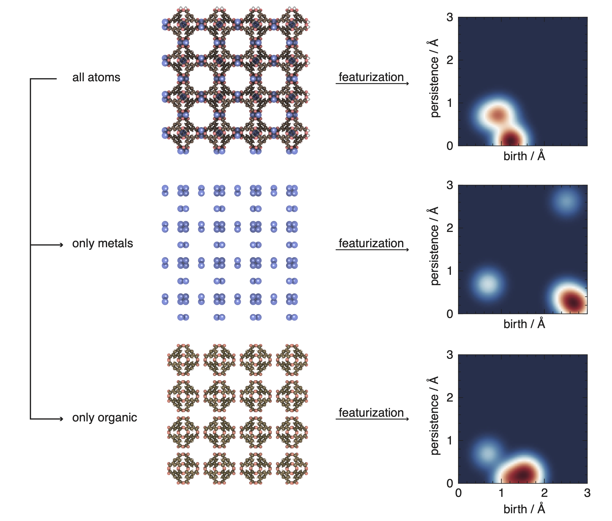

Featurizers
===================
.. Potential additional categories: High-dimensional? Models pores?

Many of the descriptors implemented in mofdscribe have been discussed in our
`2020 Chem. Rev. article
<https://pubs.acs.org/doi/10.1021/acs.chemrev.0c00004>`_.

.. needtable::
   :types: featurizer
   :style: datatables
   :columns: id, considers_geometry, considers_structure_graph, encodes_chemistry, scalar, scope

.. warning::

    Note that different featurizers have different ways in which they deal with solvent molecules.
    The RACs and SBU-centered features will ignore floating solvent molecules.
    Other featurizers, e.g. the APRDF, or pore geometry descriptors will do consider floating solvent molecules
    in the same way as framework molecules.

    If you do not want the solvent molecules to impact the featurization, you'll have to remove it from the structure.

    Bound solvent is *not* suppressed by any of the featurizers.

    To identify bound and unbound solvents, you might find the `moffragmentor package <https://github.com/kjappelbaum/moffragmentor>`_ useful.

.. note::

    You might be surprised to see new folders appear and disappear in your working directory when you run certain featurizers.
    This is expected. For some featurizers we need to create temporary files, for which we will create the temporary folders.
    You can ignore this, they will be cleaned up automatically.

Atom-centered featurizers
------------------------------

A key approximation for machine learning in chemistry is the locality
approximation. Effectively, this allows to train models on small fragments which
then (hopefully) can be used to predict the properties of larger structures.

.. toctree::
    :glob:
    :maxdepth: 1

    featurizers/atom_centered/*

Global featurizers
--------------------
In particular for porous materials, some properties are not local. For
instance, the pore geometry (key for gas adsorption) cannot be captured by
descriptor that only considers the local environment (of e.g., 3 atoms). For this reason it can make sense to also consider features that consider the full structure as a whole.

.. toctree::
    :glob:
    :maxdepth: 1

    featurizers/global/*

SBU-centered featurizers
-----------------------------

Reticular chemistry describes materials built via a tinker-toy approach.
Hence, a natural approach is to focus on the building blocks.

mofdscribe can compute descriptors that are SBU-centred, for instance, using RDKit descriptors on the building blocks.  However, you are not limited to descriptors operating on molecules -- you can convert any featurizer into an SBU-centered fearturizer:

.. code-block:: python

    from matminer.featurizers.site import SOAP
    from matminer.featurizers.structure import SiteStatsFingerprint
    from pymatgen.core import Structure

    base_feat = SiteStatsFingerprint(SOAP.from_preset("formation_energy"))
    base_feat.fit([hkust_structure])
    featurizer = SBUFeaturizer(base_feat, aggregations=("mean",))
    features = featurizer.featurize(structure=hkust_structure)

For this, you can either provide your building blocks that you extracted with any of the available tools, or use our integration with our `moffragmentor <https://github.com/kjappelbaum/moffragmentor>`_ package. In this case, we will fragment the MOF into its building blocks and then compute the features for each building block and let you choose how you want to aggregate them.

.. toctree::
    :glob:
    :maxdepth: 1

    featurizers/sbu_centered/*

.. _encoding_chemistry:
Encoding of chemistry
-----------------------

Many featurizers that traditionally do not capture the chemistry of the structure are
implemented in mofdscribe in a way that still allows to capture the chemistry.
One example for this are the topology-based descriptors.

We encode the chemistry in those case by computing the descriptor for substructures of subsets of element types; for instance, for the metal- or organic-substructure.

