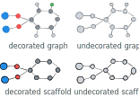

.. _dataleakage:

Addressing data leakage in digital reticular chemistry
==========================================================

Data leakage refers to the process of information from the testing stage being leaked into the training stage.
The most common sources of data leakage include (see [Kapoor]_ for more details):

* tuning or selecting the model based on test data
* using the full dataset (including test data) for pre-processing (e.g. normalization)
* duplicates in the dataset

More formally, leakage typically boils down to violation of the assumption of independence between training and test set.

Dependencies and optimism
----------------------------

The following discussion is based on [Malik]_.

Let us introduce some notation:

* A data generating process :math:`Y \sim f`  with expectation value :math:`\mathbb{E}(Y) = \mu` and covariance :math:`\mathrm{Cov}_f(Y,Y)=\mathrm{Var}_f(Y)=\Sigma`
* We build, using some process, an estimator :math:`\mathbf{\hat{\mu}_y}` and denote the predicted values for :math:`\mathbf{y*}` as :math:`\hat{\mathbf{y}*}`
* We measure the performance using the mean-squared error :math:`\|\mathbf{y} - \hat{\mathbf{y}}\|_2^2`

Following a derivation similar to the one for the bias-variance decomposition we find

.. see also https://stats.stackexchange.com/questions/88912/optimism-bias-estimates-of-prediction-error
.. math::

    \begin{aligned}
    \operatorname{err}(\hat{\mu})=& \frac{1}{n} \mathbb{E}_{f}\|Y-\widehat{Y}\|_{2}^{2} \\
    =& \frac{1}{n}\left[\mathbb{E}_{f}\|Y\|_{2}^{2}+\mathbb{E}_{f}\|\widehat{Y}\|_{2}^{2}-2 \mathbb{E}_{f}\left(Y^{T} \widehat{Y}\right)\right] \\
    =& \frac{1}{n}\left[\mathbb{E}_{f}\|Y\|_{2}^{2}+\mathbb{E}_{f}\|\widehat{Y}\|_{2}^{2}-2 \operatorname{tr} \mathbb{E}_{f}\left(Y \widehat{Y}^{T}\right)\right] \\
    &+\frac{1}{n}\left[-\mu^{T} \mu-\mathbb{E}_{f}(\widehat{Y})^{T} \mathbb{E}_{f}(\widehat{Y})+2 \mu^{T} \mathbb{E}_{f}(\widehat{Y})\right] \\
    &+\frac{1}{n}\left[\mu^{T} \mu+\mathbb{E}_{f}(\widehat{Y})^{T} \mathbb{E}_{f}(\widehat{Y})-2 \operatorname{tr} \mu \mathbb{E}_{f}(\widehat{Y})^{T}\right] \\
    =& \frac{1}{n}\left[\operatorname{tr} \Sigma+\|\mu-\mathbb{E}(\widehat{Y})\|_{2}^{2}+\operatorname{tr} \operatorname{Var}_{f}(\widehat{Y})-2 \operatorname{tr} \operatorname{Cov}_{f}(Y, \widehat{Y})\right]
    \end{aligned}

The important quantity here is :math:`\operatorname{Cov}_{f}(Y, \widehat{Y})`.
If :math:`\hat{Y}` depends on :math:`Y`, then :math:`\operatorname{Cov}_{f}(Y, \widehat{Y})` is non-zero and our estimated error underestimates the true error. This is known as optimism.

`This handout by Tibshirani <https://www.stat.cmu.edu/~ryantibs/advmethods/notes/df.pdf>`_ provides additional information.

.. admonition:: sklearn pipelines can help to reduce data leakage
    :class: tip

    If you want to minimize the potentials for data leakage in modeling pipelines, :py:class:`sklearn.pipeline.Pipeline` is a good mechanism to organize your code as it will take care for you to only fit the transformers on the training set.

Dependencies in MOF datasets
,,,,,,,,,,,,,,,,,,,,,,,,,,,,,,

The simplest case of dependence in MOF dataset is when the same MOF occurs in both the training and test set.
However, what does "same MOF" mean?
This is indeed a tricky question and in mofdscribe we assume by default that structures with the same connectivity are the same. Note that this is a very conservative definition as it will consider, for example, open and closed pore structures as the same structure.

In the datasets, where those duplicates are dropped by default you can disable this via the :code:`drop_basename_duplicates`  and :code:`drop_graph_duplicates` keyword arguments.

However, are UiO-66 and UiO-66-NH2 really independent? We do not think so. Therefore, we recommend the use of the :py:class:`~mofdscribe.splitters.HashSplitter` which will, by default, ensure that a scaffold will occur in either train or test set. By default, it will do so using the undecorated scaffold hash (most conservative setting). Depending on your application might want to use another of the available hash flavors that are illustrated in the figure below

.. admonition:: Limitations of benchmark sets (adaptive overfitting)
    :class: note

    While we provide benchmark tasks with mofdscribe we realize that, after a given time, any improvements in performance
    on the tasks might only be due to adaptive overfitting of the community on the benchmark.
    In other words, if we want to compute significance tests for improvements on the leaderboard we would need to correct for
    multiple testing. However, since the number of attempts is not clear for public benchmarks, this is tricky in practice.

    We ask users to keep this in mind when using and referring to the benchmarks and the leaderboard.
