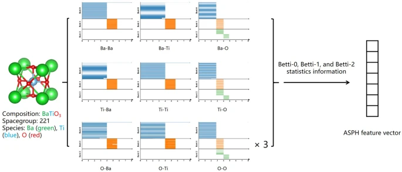

Atom-centered Persistent Homology
.............................................

The idea is to compute persistent-homology described descriptors for local environments.

.. featurizer::  AtomCenteredPH
    :id: AtomCenteredPH
    :considers_geometry: True
    :considers_structure_graph: False
    :encodes_chemistry: optionally
    :scope: global
    :scalar: False

    Initially described in [Jiang2021]_.
