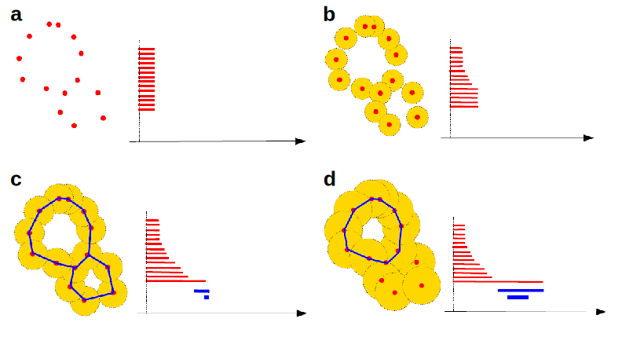

Topological descriptors
.............................................
For many applications of porous materials the _shape_ of the material, e.g., the
pore shape, is relevant for the application. Topology is the branch of
mathematics that deals with shapes and one of the most widely used topological
techniques to describe shapes is known as persistent homology.

.. note::

    Note that under topology we understand here the embedding topology
    and not the one of the underlying structure graph (i.e. the connectivity).

Formally speaking, persistent homology tracks the changes of homology groups in
a filtration. This becomes quite clear in the following example. In this figure,
we perform a filtration and record the result in a persistence diagram. To make
the filtration, we simply start increasing the "radius" of the atoms in the
structure. Then we track when certain shapes (e.g., rings) appear and disappear.
The "birth" and "death" of a shape is recorded in the diagram with a bar
starting at the birth time and ending at the death time (e.g. in Angstrom).

mofdscribe provides users with two ways of encoding chemistry in descriptors derived from persistent homology analysis: 

1. We can compute the descriptors on substructures consisting of only specific elements (e.g., metals, organic). See :ref:`Encoding Chemistry <encoding_chemistry>` for more details.
2. We can encode the different element types by using different radii for different elements. You can enable this by setting :code:`alpha_weight` to :code:`atomic_radius_calculated` or :code:`van_der_waals_radius`

Vectorizing persistence diagrams
,,,,,,,,,,,,,,,,,,,,,,,,,,,,,,,,,,,,
For many machine learning models, fixed length vectors are required.
Persistence diagrams, however, are not fixed length. In `mofdscribe` we provide
two methods to vectorize persistence diagrams.

Persistence images
~~~~~~~~~~~~~~~~~~~
A method that has been used before for porous materials are persistence diagrams
that have been introduced by Adams et al. in [Adams2017]_. The idea here is to (in simplified terms)

(1) Rotate the persistence diagram such that the diagonal is horizontal (to minimize the empty space).
(2) Smear the persistence diagram with a Gaussian kernel.

.. featurizer::  PHImage
    :id: PHImage
    :considers_geometry: True
    :considers_structure_graph: False
    :encodes_chemistry: optionally
    :scope: global
    :scalar: False

    Persistence images have been proposed in [Adams2017]_.
    They have been used in [Krishnapriyan2021]_, [Krishnapriyan2020]_ on which implementation we rely internally.

Gaussian mixture components
~~~~~~~~~~~~~~~~~~~~~~~~~~~~~
Unexplored for porous materials is to use Gaussian mixture models to vectorize
persistence diagrams. The idea is to train a Gaussian mixture model on a
training set of persistence diagrams and then use the model to vectorize a test
set of persistence diagrams (using the weighted maximum likelihood estimate of
the mixture weights as vector components). [Perea]_ [Tymochko]_

.. featurizer::  PHVect
    :id: PHVect
    :considers_geometry: True
    :considers_structure_graph: False
    :encodes_chemistry: optionally
    :scope: global
    :scalar: False

    We use the implementation in the `pervect <https://github.com/scikit-tda/pervect>`_ package, which builds on [Perea]_ [Tymochko]_.

Statistics of persistence diagrams
~~~~~~~~~~~~~~~~~~~~~~~~~~~~~~~~~~
In addition to the vectorization approaches describes above we also allow for the computation of statistics of persistence diagrams (e.g. mean birth time, max persistence, ...).

.. featurizer::  PHStats
    :id: PHStats
    :considers_geometry: True
    :considers_structure_graph: False
    :encodes_chemistry: optionally
    :scope: global
    :scalar: False

    We use, in the background, code described in  [Krishnapriyan2021]_, [Krishnapriyan2020]_ (which itself relies on the Dionysus library).

Clearly, one can also compute histograms of characteristic properties (e.g. birth times, persistences, ...).

.. featurizer::  PHHist
    :id: PHHist
    :considers_geometry: True
    :considers_structure_graph: False
    :encodes_chemistry: optionally
    :scope: global
    :scalar: False

    We use, in the background, code described in  [Krishnapriyan2021]_, [Krishnapriyan2020]_ (which itself relies on the Dionysus library).
