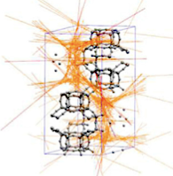

Pore descriptors
.........................................

Scalars describing the pore geometry
,,,,,,,,,,,,,,,,,,,,,,,,,,,,,,,,,,,,,,,,,,,,,
For describing the pore geometry, we heavily rely on methods implemented in the `zeopp <http://www.zeoplusplus.org/>`_ package.

The most commonly used pore-geometry descriptors (surface areas, probe
accessible pore volumes, ...) are computed with a probe approach. By means of
"simple" geometry analysis one can also extract pore radii.

.. image:: http://www.zeoplusplus.org/spheres.png
  :width: 200
  :alt: Pore diameters.

.. featurizer::  SurfaceArea
    :id: SurfaceArea
    :considers_geometry: True
    :considers_structure_graph: False
    :encodes_chemistry: False
    :scope: global
    :scalar: False

    We use the implementation in the `zeopp <http://www.zeoplusplus.org/>`_ package [Willems2011]_.

.. featurizer::  PoreDiameters
    :id: PoreDiameters
    :considers_geometry: True
    :considers_structure_graph: False
    :encodes_chemistry: False
    :scope: global
    :scalar: False

    We use the implementation in the `zeopp <http://www.zeoplusplus.org/>`_ package [Willems2011]_.

.. featurizer::  AccessibleVolume
    :id: AccessibleVolume
    :considers_geometry: True
    :considers_structure_graph: False
    :encodes_chemistry: False
    :scope: global
    :scalar: False

    We use the implementation in the `zeopp <http://www.zeoplusplus.org/>`_ package [Willems2011]_ [Ongari2017]_.

Histograms
,,,,,,,,,,,,

An alternative to scalar descriptors are "summaries" of the pore geometry in
histograms. One approach for instance is to shoot random rays (orange in the
figure below) through the structure and use the length of the ray between the
points where it intersects the pores as ray length. If one performs this
experiment often, one can summarize the observed ray lengths in a histogram.

Another, quite sparse, alternative is to use the pore size distribution (PSD) of
the structure. That is, PSD histograms measure what fraction of the void space
volume corresponds to certain pore sizes. One might also use this as cumulative
distribution or take the derivative.

.. featurizer::  RayTracingHistogram
    :id: RayTracingHistogram
    :considers_geometry: True
    :considers_structure_graph: False
    :encodes_chemistry: False
    :scope: global
    :scalar: False

    We use the implementation in the `zeopp <http://www.zeoplusplus.org/>`_ package. The feature itself was described and used in [Pinheiro2013]_.

.. featurizer::  PoreSizeDistribution
    :id: PoreSizeDistribution
    :considers_geometry: True
    :considers_structure_graph: False
    :encodes_chemistry: False
    :scope: global
    :scalar: False

    We use the implementation in the `zeopp <http://www.zeoplusplus.org/>`_ package. The feature itself was described and used in [Pinheiro2013]_.
