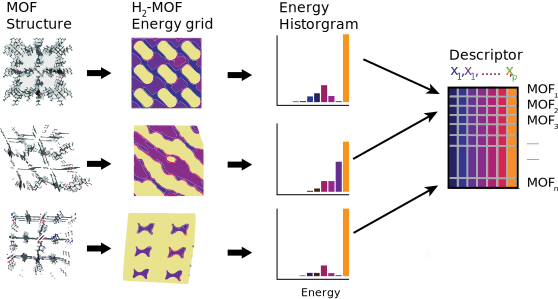

Molecular simulation derived/inspired
=======================================

Energy grid histogram
.............................................

In molecular simulations, the interactions between atoms are described using
intermolecular potentials such as the Lennard-Jones potential. Since this
potential must be frequently evaluated one can save computational cost by
pre-computing the potentials on a grid. The grids themselves are not necessarily
fixed-length, and typically high-dimensional. Therefore, they are not directly
used as descriptors. Again, one can solve this problem by "summarizing" the grid
in form of a histogram.

  Converting MOF structures into energy grids and using them as descriptors in
  form of histograms. Figure taken from [Bucior2019]_.

.. featurizer::  EnergyGridHistogram
    :id: EnergyGridHistogram
    :considers_geometry: True
    :considers_structure_graph: False
    :encodes_chemistry: True
    :scope: global
    :scalar: False

    The feature was proposed in [Bucior2019]_. We use the implementation in [Dubbeldam]_

Henry coefficent
..................

The Henry coefficient is strongly connected to the energy grid and might sometimes be a more useful (since it is a scalar) descriptor.

.. featurizer::  Henry
    :id: Henry
    :considers_geometry: True
    :considers_structure_graph: False
    :encodes_chemistry: True
    :scope: global
    :scalar: False

    We use the implementation in [Dubbeldam]_
