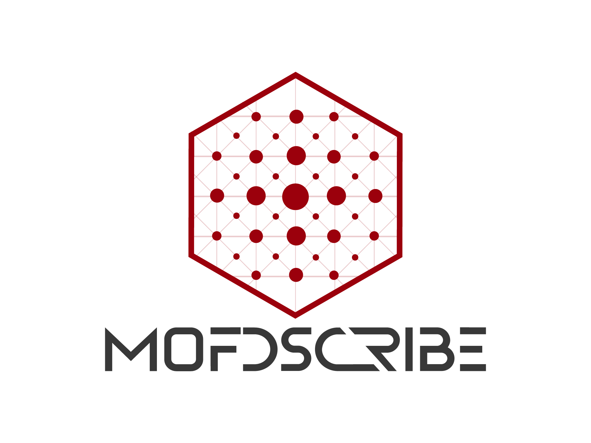

mofdscribe |release|
======================

mofdscribe is a Python library for digital reticular chemistry.
mofdscribe contains 30+ featurizers that have been adapted from scientific
publications (or that have been not reported so far) and are accessible using
the consistent and battle-proof `matminer
<https://hackingmaterials.lbl.gov/matminer/>`_ API.

mofdscribe is open source via a MIT license.

why mofdscribe?
-----------------
   
Currently, machine learning practitioners in the field of reticular chemistry
are using a wide variety of tools, and different scripts, to compute features as
input for machine learning studies or to perform other steps in the ML workflow. 
The main goal of this project is to provide
a unified interface for digital reticular chemistry: from dataset up to publication.

Since many featurizers are quite domain specific, and require external
dependencies, the featurizers are currently not integrated in matminer itself.

.. toctree::
   :maxdepth: 2
   :caption: Table of Contents

   installation
   getting_started
   dataleakage
   splitters
   datasets
   background
   leaderboard
   contributing
   api
   maintaining
   references

Indices and Tables
------------------
* :ref:`genindex`
* :ref:`modindex`
* :ref:`search`
