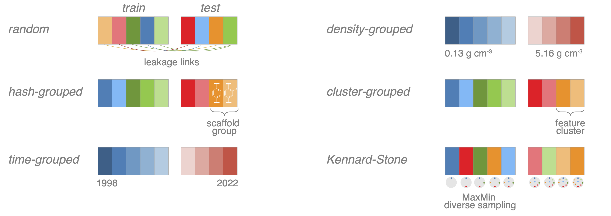

.. _splitters:

Data splitters
===============

One important mechanism for avoiding data leakage (see :ref:`dataleakage`) is the use of proper splitting techniques.
mofdscribe implements a range of different approaches, some of which are illustrated in the figure below 

As a good default we recommend the use of the :py:class:`HashSplitter`, which by default will keep different scaffold sets in different folds.

.. note:: 

    If you perform a train/test split with a hash splitter and a stratification column,
    you might be surprised that you will not receive the exact train/test ratio you requested.
    This is because we perform the stratified split on the group level to be able to guarantee 
    the grouping.